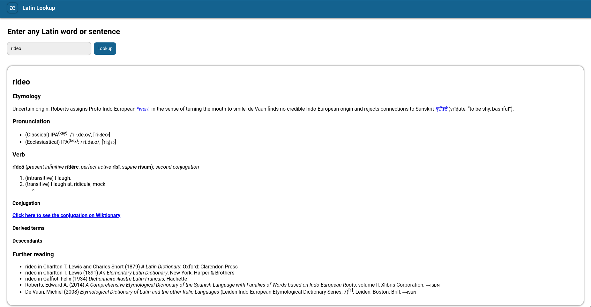

# Latin Lookup

# Introduction
Latin Lookup is a web tool that will allow you to get the best out of the Wiktionary site for the Latin language. This project aims to make it easier to find Latin resources on Wiktionary by removing all non-Latin content from search queries.

# Learn
Interested in learning latin? Here are some resources to help get you started:
- Placeholder
- Placeholder
- Placeholder
